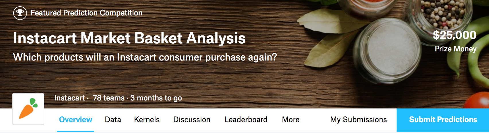

Instacart Market Basket Analysis - Team Wabbit
==============================


# Description

Whether you shop from meticulously planned grocery lists or let whimsy guide your grazing, our unique food rituals define who we are. Instacart, a grocery ordering and delivery app, aims to make it easy to fill your refrigerator and pantry with your personal favorites and staples when you need them. After selecting products through the Instacart app, personal shoppers review your order and do the in-store shopping and delivery for you.

Instacart’s data science team plays a big part in providing this delightful shopping experience. Currently they use transactional data to develop models that predict which products a user will buy again, try for the first time, or add to their cart next during a session. Recently, Instacart open sourced this data - see their blog post on 3 Million Instacart Orders, Open Sourced.

In this competition, Instacart is challenging the Kaggle community to use this anonymized data on customer orders over time to predict which previously purchased products will be in a user’s next order. They’re not only looking for the best model, Instacart’s also looking for machine learning engineers to grow their team.

Winners of this competition will receive both a cash prize and a fast track through the recruiting process. For more information about exciting opportunities at Instacart, check out their careers page here or e-mail their recruiting team directly at ml.jobs@instacart.com.

# Evaluation

Submissions will be evaluated based on their mean F1 score.

## Submission File

For each order_id in the test set, you should predict a space-delimited list of product_ids for that order. If you wish to predict an empty order, you should submit an explicit 'None' value. You may combine 'None' with product_ids. The spelling of 'None' is case sensitive in the scoring metric. The file should have a header and look like the following:

```
order_id,products  
17,1 2  
34,None  
137,1 2 3  
etc.
```

# Timeline

- August 7, 2017 - Entry deadline. You must accept the competition rules before this date in order to compete.
- August 14, 2017 - Final submission deadline.

All deadlines are at 11:59 PM UTC on the corresponding day unless otherwise noted. The competition organizers reserve the right to update the contest timeline if they deem it necessary.

How to contribute to this project
------------
This project borrows best practices from Cookie Cutter Data Science and Data Science is Software.
The project makes use of a Makefile to automate data acquisition and munging.

- https://drivendata.github.io/cookiecutter-data-science/
- https://github.com/drivendata/data-science-is-software/tree/master/notebooks
- http://blog.kaggle.com/2012/10/15/make-for-data-scientists/

Its not dogma, but it's really helpful for collaborative projects.

The file structure is pretty intuitive. Put notebooks in the notebooks folder. Refactor good code that you make in your notebooks into py files that go into the src folder.

You can store your AWS credentials and other sensitive info in a .env file. Every time you run the Makefile, your ~/data/ folder will automatically sync up with a configured S3 bucket.

The goal is to streamline all of your data munging modules into a `~/src/data/make_dataset.py` file that will execute all the steps in a DAG. This script can be run in the Makefile so a new team-member of whoever just has to run the Makefile to be setup and dandy for modeling.

the `.gitignore` makes sure you don’t push files like `.env` or your `/data/` files to github.

## Basic Git Workflow

1) Fork the repo
2) Set ‘origin’ to your forked repo.
3) Set 'upstream' to https://github.com/AAbercrombie0492/Instacart_Predictions.git
3) Push changes to ‘origin’
4) When you want to share, make a pull request to sync your 'origin' to the 'upstream' branch.
5) To get updates from 'upstream': `git fetch upstream master`

Project Organization
------------

    ├── LICENSE
    ├── Makefile           <- Makefile with commands like `make data` or `make train`
    ├── README.md          <- The top-level README for developers using this project.
    ├── data
    │   ├── external       <- Data from third party sources.
    │   ├── interim        <- Intermediate data that has been transformed.
    │   ├── processed      <- The final, canonical data sets for modeling.
    │   └── raw            <- The original, immutable data dump.
    │
    ├── docs               <- A default Sphinx project; see sphinx-doc.org for details
    │
    ├── models             <- Trained and serialized models, model predictions, or model summaries
    │
    ├── notebooks          <- Jupyter notebooks. Naming convention is a number (for ordering),
    │                         the creator's initials, and a short `-` delimited description, e.g.
    │                         `1.0-jqp-initial-data-exploration`.
    │
    ├── references         <- Data dictionaries, manuals, and all other explanatory materials.
    │
    ├── reports            <- Generated analysis as HTML, PDF, LaTeX, etc.
    │   └── figures        <- Generated graphics and figures to be used in reporting
    │
    ├── requirements.txt   <- The requirements file for reproducing the analysis environment, e.g.
    │                         generated with `pip freeze > requirements.txt`
    │
    ├── src                <- Source code for use in this project.
    │   ├── __init__.py    <- Makes src a Python module
    │   │
    │   ├── data           <- Scripts to download or generate data
    │   │   └── make_dataset.py
    │   │
    │   ├── features       <- Scripts to turn raw data into features for modeling
    │   │   └── build_features.py
    │   │
    │   ├── models         <- Scripts to train models and then use trained models to make
    │   │   │                 predictions
    │   │   ├── predict_model.py
    │   │   └── train_model.py
    │   │
    │   └── visualization  <- Scripts to create exploratory and results oriented visualizations
    │       └── visualize.py
    │
    └── tox.ini            <- tox file with settings for running tox; see tox.testrun.org


--------

<p><small>Project based on the <a target="_blank" href="https://drivendata.github.io/cookiecutter-data-science/">cookiecutter data science project template</a>. #cookiecutterdatascience</small></p>
